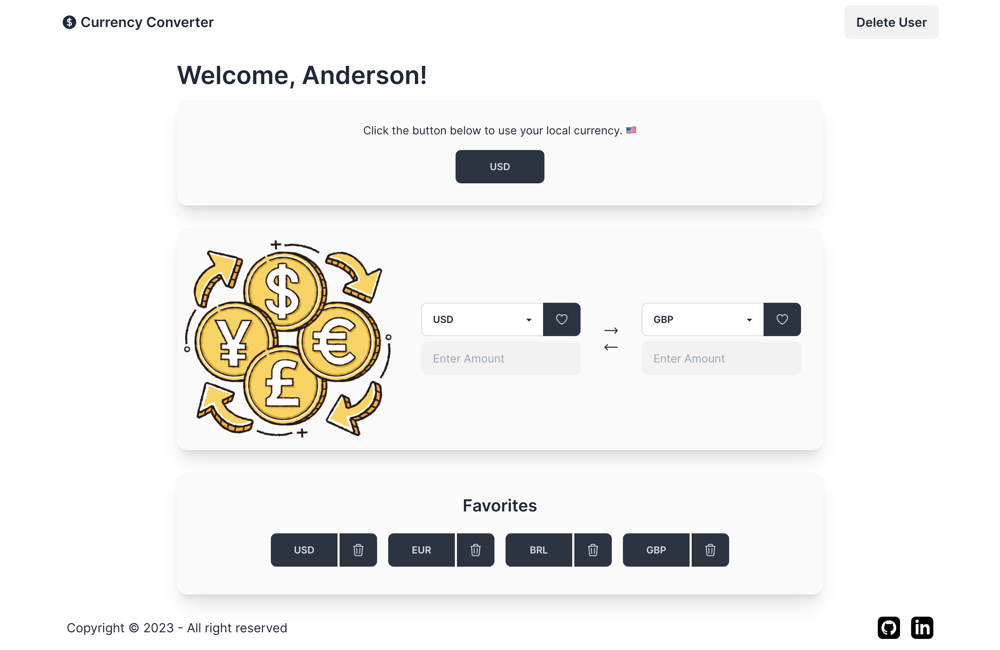
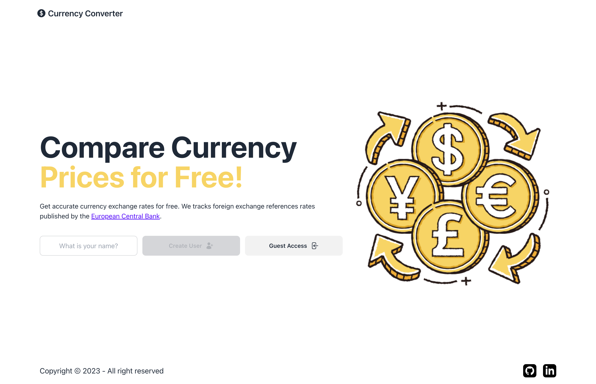
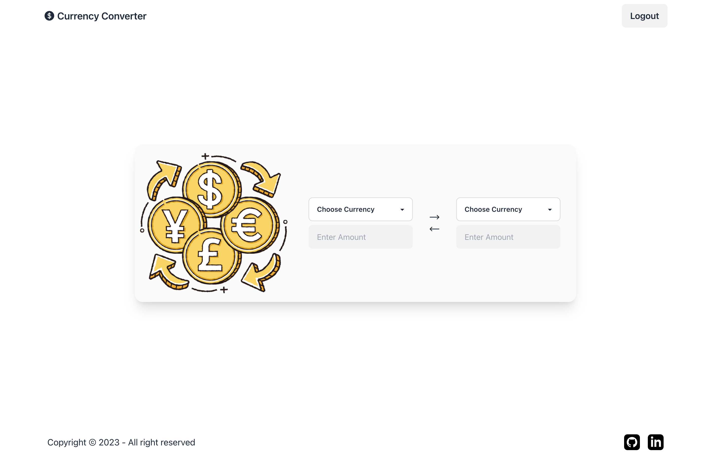
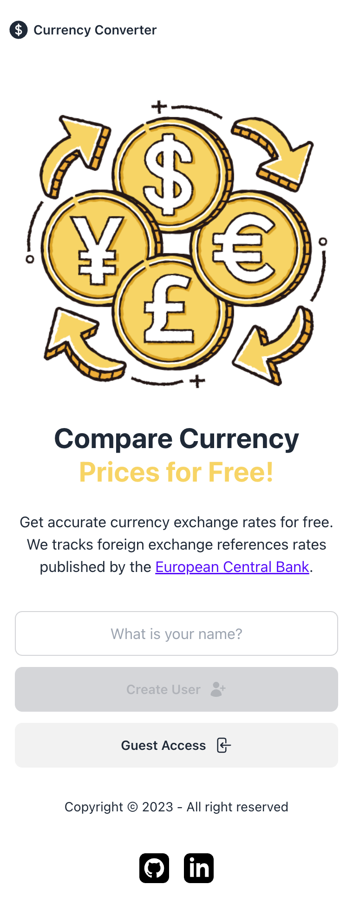
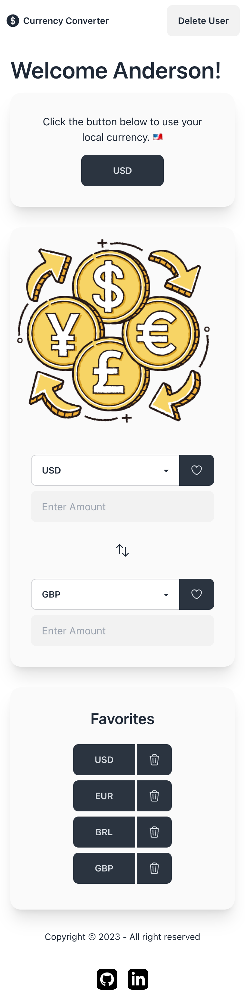
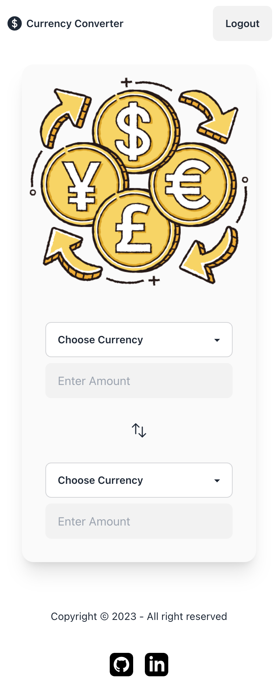

# Currency Converter



## About The Project

A currency converter developed in React. The application fetches real-time currency exchange rates and allows users to convert any amount from one currency to another.

**Built with:** [Vite](https://vitejs.dev/) • [JavaScript](https://www.javascript.com/) • [React](https://react.dev/) • [React Router](https://reactrouter.com/) • [TailwindCSS](https://tailwindcss.com/) • [DaisyUI](https://daisyui.com/)

### Features

- Real-time currency conversion
- Geolocation based on IP address
- Works with all major global currencies

**Try it →** https://fm-anderson-currency-converter.netlify.app/

## Getting Started

### Prerequisites

This project was bootstrapped with [Vite](https://github.com/vitejs/vite). Ensure you have Node.js and npm (or any other package manager) installed on your local machine.

### Installation

1. Clone this repo
   ```sh
   git clone https://github.com/fm-anderson/currency-converter.git
   ```
2. Navigate to the project directory
   ```sh
   cd currency-converter
   ```
3. Install dependencies
   ```sh
   npm install
   ```
4. Run the application
   ```sh
   npm run dev
   ```
5. The application should be running on http://localhost:5173

## Usage

1. To convert from one currency to another, select the currency and input the amount.
2. Select the target currency.
3. The converted amount will appear in the opposite input field.

## API

[VAT comply](https://vatcomply.com/)
provides the exchange rates and the geolocation for Currency Converter.

## Screenshots (Desktop)

**Home:** Home page is shown to users that are not logged in.


---

**Dashboard:** Complete dashboard is available for users that created an account.


---

**Guest Access:** Basic dashboard without local currency or favorites.


---

## Screenshots (Mobile)



---



---



---
